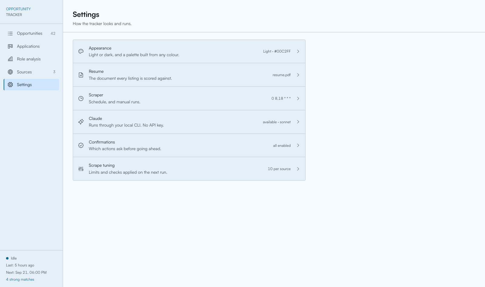

# Opportunity Tracker

**Find jobs, internships and research programs worth your time — and know how you
measure up before you apply.**

Opportunity Tracker watches the job boards and research programs you care about,
reads every new listing against your resume, and scores it out of 10. You get a
ranked shortlist instead of a search-results page, plus a straight answer on what
each role wants and where your resume falls short.

It runs entirely on your own machine. Your resume never leaves it.


---

## What it does

**Watches sources for you.** Add a job board, a company careers page or a research
program and it checks them on a schedule. New listings arrive already read and
scored; ones you have already seen are skipped.

**Scores every listing against your resume.** Not keyword matching — an actual
read of the posting against your experience, with a one-line verdict on why it
scored what it did. Anything at 7.5 or above is flagged a strong match.

**Tells you what to fix.** Open a listing and ask for resume advice: every
requirement marked met, partial or gap, with the evidence from your own resume
that supports it, and concrete rewrites ordered by impact. It will never invent
experience you do not have.

**Shows you the bigger picture.** Role analysis reads your whole shortlist at once
and tells you which requirements keep recurring, which ones you already meet, and
what to learn next.

**Tracks what you have applied to.** A kanban board from bookmarked through
applied, interview and offer, with deadlines and notes.

**Comes with an assistant.** A built-in agent that can reorganise your data, hunt
for new sources, write reports — and, if you let it, modify the app itself.

---

## Before you start

You will need four things:

| | Why | Get it |
|---|---|---|
| **[Claude Code](https://claude.com/claude-code)** | Reads and scores your listings | Install it and sign in |
| **Python 3.11+** | Runs the app | `brew install python@3.13`, or `apt install python3 python3-venv` |
| **Node 18+** | Builds the interface | <https://nodejs.org/en/download> |
| **git** | Optional — lets the built-in agent undo its own changes | Usually already installed |

**There is no API key to buy or configure.** Everything goes through the Claude
Code login you already have, so scoring a listing costs you nothing beyond your
existing subscription.

---

## Install

```bash
git clone https://github.com/Axelph237/opportunity-tracker.git
cd opportunity-tracker
./scripts/install.sh
./scripts/start.sh
```

That is the whole thing. The installer sets up Python, builds the interface and
downloads the fonts; `start.sh` opens <http://localhost:8000>.

Re-running `./scripts/install.sh` is also how you upgrade after a `git pull`.

### First run

The app walks you through five short steps, saving as it goes — quitting halfway
keeps whatever you already answered.

1. **Connect Claude Code.** It looks for the CLI and reports the version it found.
   If it is not on your `PATH`, paste the full path and it will be checked before
   it is saved.
2. **Choose your colours.** Pick any colour and the whole interface is themed from
   it. Light, dark, or follow the system.
3. **Name your assistant.** A name and an animal icon. Both changeable later.
4. **Add your resume.** A PDF or a text file. This is what every listing is scored
   against.
5. **Run a first search.** Optionally scrape the 20 starter sources and ask Claude
   to suggest more. Both run in the background while you look around.

---

## Using it

### Your shortlist

**Opportunities** is the main table — every listing found, newest first. Strong
matches carry a coloured left border. Click any row to open the full posting, its
score and the reasoning behind it.

Click a column header to sort; click again to flip it. Filter by type, experience
level, source, score range, remote, closing soon, whether you are already tracking
it, or just type in the search box. Filtering applies across the whole table, not
just the rows on screen.

### Checking your fit

Open a listing and switch to the **Resume fit** tab, then press **Suggest resume
adjustments**. You get:

- a fit score for your resume *as currently written*, and a short verdict
- every requirement marked **met**, **partial** or **gap**, each with the evidence
  from your resume — or a note on what is missing
- concrete rewrites: the current line, the suggested replacement, and why it helps
  for this role, ordered by impact
- keywords worth mirroring and talking points for a cover letter or interview

The diamond in the table's **Fit** column shows which listings already have advice
saved (◆) and which do not (◇). Advice is cached, so reopening it is instant.
Upload a new resume and older advice is flagged stale with a button to refresh it.

### The bigger picture

**Role analysis** reads your listings as a set instead of one at a time. Pick a
scope — a type, an experience level, strong matches only, a search term — and run
it. You get the natural clusters in what you are tracking, the requirements that
keep recurring and whether you meet them, and a ranked list of what to learn next
with a realistic effort estimate for each.

### Tracking applications

Press **Track application** on any listing and it joins the **Applications**
board: bookmarked → planning to apply → applied → assessment → interview → offer.
Drag cards between columns, or switch to the table view in the top right. Each
application holds its own deadline override, notes and contacts.

### Managing sources

**Sources** lists everywhere the app looks. Add one with **+ Add source** — a
name, a URL, and how to read it:

- **HTML** — parse the page (the usual choice)
- **API** — the URL returns JSON
- **Search query** — a search URL your term gets appended to

**Scrape** on any row fetches that source immediately. **Settings → Scraper → Run
now** does all of them, with a live progress log.

#### Letting Claude find sources

**Discover new sources** searches the web for boards worth adding. Give it a focus
if you like ("superconducting qubit startups") and a count. It skips anything you
already track and comes back with proposals, each with a rationale and a
confidence score — usually in one to three minutes.

Nothing is scraped until you approve it. Rejecting a proposal also keeps that URL
out of future discovery runs.

#### When a source stops working

The **Last scraped** column tells you how the last attempt went:

| | Meaning | Scrape button |
|---|---|---|
| **Blocked** (red) | The site is refusing us | Disabled |
| **Failed** (blue) | A timeout, a server error, an unreadable page | Still works |
| *a timestamp* | It worked | Works |

Hover either tag for the reason and when it was last tried.

A **Blocked** source is not a dead end. Scheduled runs keep trying, and the tag
clears the moment one succeeds. Editing the URL clears it immediately too — which
is the usual fix, since many sites that block scrapers still publish an open RSS
or JSON feed. Some sites simply will not allow automated access; deactivate those
so they stop being attempted.

### Keeping it accurate

Everything Claude writes can be corrected by hand, and your edits survive the next
scrape — a rescrape that recognises a URL only refreshes when it was last seen.

| What | Where |
|---|---|
| A listing | Opportunities → click a row → **Edit** tab |
| A source | Sources → the pencil icon |
| A role analysis | Role analysis → **Edit analysis** |

Setting a score of 7.5 or above marks a listing a strong match, exactly as the
scorer would. A hand-edited role analysis is labelled *edited by hand* so it is
never mistaken for Claude's own output.

The trash icon deletes a listing, along with any tracked application and saved
resume advice. Its URL is remembered so a future scrape does not bring it back.

### Dead links never reach your table

Postings expire constantly, and many sites answer a dead posting with a
friendly-looking page and a `200 OK` rather than a 404. Every listing is checked
before it is stored, and pages that turn out to be gone are dropped rather than
saved. To clean up older rows added before a check existed:

```bash
.venv/bin/python backend/scraper.py --prune-dead --dry-run   # look first
.venv/bin/python backend/scraper.py --prune-dead             # then do it
```

### Scheduled scraping

By default the app scrapes twice a day, at 8am and 6pm, whenever it is running.
Change the schedule in **Settings → Scraper**.

If you would rather it run whether or not the app is open, there is a cron script
that drives Claude Code directly — it scrapes, reviews the results, disables
sources that have failed repeatedly, and writes a report to `logs/`:

```bash
crontab -e
0 8,18 * * * /path/to/opportunity-tracker/scripts/run_scrape.sh
```

---

## Your assistant

The tab pinned to the bottom of the sidebar is a Claude Code session that knows
this installation — its database, its files, its scripts. Ask it things like
*"tag everything in Chicago"*, *"which of my strong matches close this month?"* or
*"find me three more quantum hardware boards"*.

Give it a name and an icon in **Settings → Appearance**.

### Two modes

| Mode | What it can do |
|---|---|
| **Assist** (default) | Query and reorganise your data, run scrapes, research sources, write reports |
| **Build** | All of the above, plus editing the app's own code and configuration |

Pick the mode and the Claude model from the composer. The paperclip attaches files
or URLs for it to work from.

### Nothing changes until you say so

Every turn runs **read-only first**. The assistant can look at anything, but it
cannot change anything — the tools simply are not available to it. If the task
needs changes, it describes exactly what it intends to do and waits. Approve, and
it carries out precisely what it described.

This is enforced by the permission layer rather than by trusting the model, and
Assist mode genuinely cannot touch application code even if you ask it to.

**Build mode is a different bargain, and worth understanding before you use it.**
To edit and build the app it needs to run `python`, `node` and `npm`, and those
are general-purpose — anything they can do, an approved Build turn can do. The
harness's own subagent and skill tools are switched off in every mode, and the
destructive git commands are blocked, but "it cannot run arbitrary code" is not a
promise Build mode can make. Approve a Build plan the way you would run a script
someone handed you.

### Undoing its work

Every message you send commits the project first, so each one is a point you can
rewind to. Hover a message you sent and a **rewind arrow** appears at its top
right — click it to put the files back to how they were just before that message.
You are shown exactly which files will change before anything happens.

If nothing has changed since a message, the arrow stays visible but goes inert and
says so, rather than doing nothing silently.

Two limits worth knowing: this restores **files, not your database**, so data the
assistant reorganised is not rolled back; and the rewind itself is committed, so
it can be undone too. Restore points live in `data/checkpoints.git`, separate from
your own git history — deleting that folder discards them and nothing else.

---

## Settings

| Section | What is in it |
|---|---|
| **Appearance** | Theme colour, light/dark/system, palette style, contrast, assistant name and icon |
| **Resume** | Upload or replace the resume everything is scored against |
| **Scraper** | Run a scrape now, watch progress, set the schedule |
| **Claude** | Where the Claude Code CLI lives, and which model to use |
| **Confirmations** | Turn "are you sure?" prompts back on after dismissing them |
| **Scrape tuning** | Politeness delay, request timeout, how much of each page to read |



---

## Privacy

**Everything stays on your machine.** The database, your resume and every listing
live in `data/` on your own disk. There is no account, no server, and nothing is
uploaded anywhere.

**Claude only sees what it needs.** Scoring sends the text of a listing and your
resume to Claude through the Claude Code CLI, using the login you already have.
There is no API key stored anywhere in this project, and the app does not use one.

**Every button that costs a Claude call is marked** with a sparkle and says "Runs
a Claude call" on hover. Anything unmarked is instant and free.

**The scraper identifies itself** as `OpportunityTracker` rather than pretending to
be a browser, and waits two seconds between requests to the same site. Some sites
will refuse it as a result; that is the intended trade.

---

## Troubleshooting

**"claude CLI not found"** — Claude Code is not on your `PATH`. Find it with
`which claude` and paste the full path into Settings → Claude.

**Everything shows "API offline"** — the server is not running. Start it with
`./scripts/start.sh`.

**A source says Blocked** — that site refuses automated access. Try an alternative
URL (many have an open RSS or JSON feed), or deactivate it.

**Scores look generic** — no resume is loaded. Add one in Settings → Resume.

**A scrape found nothing** — the page may build its listings with JavaScript,
which the scraper does not run. Look for a plain-HTML or JSON version of the same
board.

**The interface did not change after editing the code** — the app serves a
compiled bundle. Run `npm run build` in `frontend/`, or `./scripts/install.sh`.

**Port 8000 is taken** — `./scripts/start.sh --port 9000`.

---

## For developers

FastAPI + SQLite on the backend, React + Vite + Tailwind on the front. One process
serves both: the API answers `/api/*` and the compiled interface handles
everything else.

```bash
./scripts/dev.sh                          # API on :8000 + Vite dev server on :5173
.venv/bin/pip install -r requirements-dev.txt
.venv/bin/pytest                          # 234 backend tests
cd frontend && npm test                   # 112 frontend tests
```

The test suites never touch your real database — every backend test runs against
a temporary one, with a guard that fails the run if anything tries to open the
real path.

Interactive API docs are at <http://localhost:8000/docs> while the app is running.

```
backend/      FastAPI service — routes, schema, scraper, scoring, the agent
frontend/     React interface; dist/ is the built bundle that gets served
scripts/      install.sh, start.sh, dev.sh, run_scrape.sh
data/         Your database, uploads and agent restore points (never in git)
```

Most backend modules also run standalone, which is the quickest way to test one:

```bash
.venv/bin/python backend/scraper.py --list
.venv/bin/python backend/advisor.py landscape
.venv/bin/python backend/scheduler.py          # print the next four fire times
```

Schema changes are additive — missing columns are added on startup, so upgrading
never loses data.

---

## License

MIT — see [LICENSE](LICENSE).

| | License | |
|---|---|---|
| [Phosphor Icons](https://phosphoricons.com) | MIT | bundled |
| [`material-color-utilities`](https://github.com/material-foundation/material-color-utilities) | Apache-2.0 | bundled |
| React, Vite, Tailwind, FastAPI and friends | MIT / BSD / Apache-2.0 | bundled |
| [Satoshi](https://www.fontshare.com/fonts/satoshi) | ITF Free Font License | **not redistributed** — downloaded at install time |

Satoshi's licence permits self-hosting but not redistribution, so the font files
are not in this repository; `install.sh` fetches them from Fontshare and each
installation is its own licensee. If the download fails the app falls back to your
system font and everything still works.
