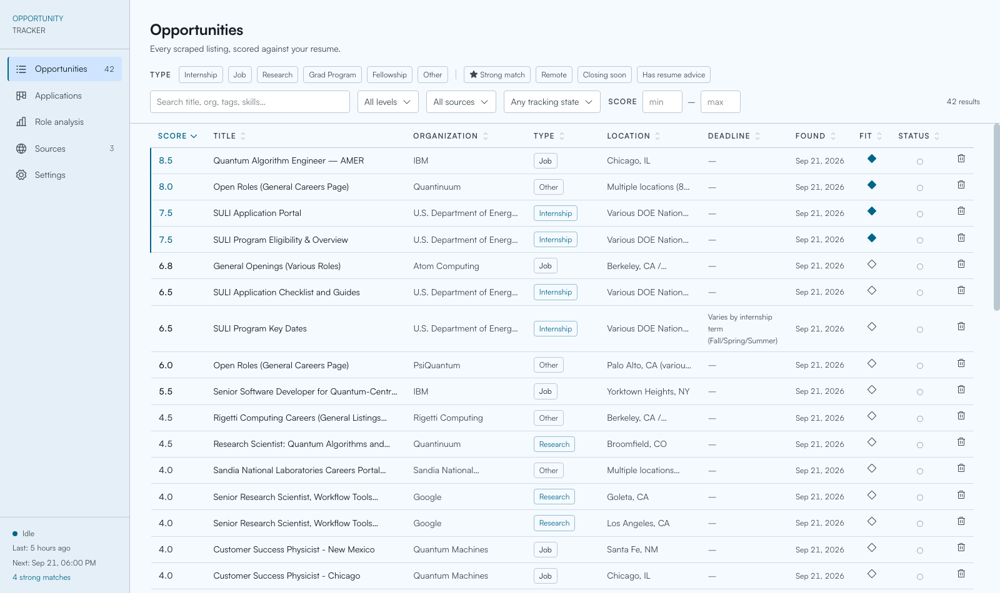

# Opportunity Tracker

**Find jobs, internships and research programs worth your time — and know how you
measure up before you apply.**

Opportunity Tracker watches the job boards and research programs you care about,
reads every new listing against your resume, and scores it out of 10. You get a
ranked shortlist instead of a search-results page, plus a straight answer on what
each role wants and where your resume falls short.

It runs entirely on your own machine. Your resume never leaves it.



---

## Contents

- [Opportunity Tracker](#opportunity-tracker)
  - [Contents](#contents)
  - [What it does](#what-it-does)
  - [Before you start](#before-you-start)
  - [Install](#install)
    - [Uninstalling](#uninstalling)
  - [Using it](#using-it)
    - [Your shortlist](#your-shortlist)
    - [Checking your fit](#checking-your-fit)
    - [The bigger picture](#the-bigger-picture)
    - [Tracking applications](#tracking-applications)
    - [Managing sources](#managing-sources)
      - [Letting Claude find sources](#letting-claude-find-sources)
      - [When a source stops working](#when-a-source-stops-working)
    - [Scheduled scraping](#scheduled-scraping)
  - [Your assistant](#your-assistant)
    - [Two modes](#two-modes)
    - [Build Mode: continued](#build-mode-continued)
    - [Undoing its work](#undoing-its-work)
  - [Troubleshooting](#troubleshooting)
  - [For developers](#for-developers)
  - [AI Use Disclosure](#ai-use-disclosure)
  - [License](#license)

---

## What it does

**Watches sources for you.** Add a job board, a company careers page or a research
program and it checks them on a schedule. New listings arrive already read and
scored; ones you have already seen are skipped.

**Scores every listing against your resume.** Not keyword matching — an actual
read of the posting against your experience, with a one-line verdict on why it
scored what it did. Anything at 7.5 or above is flagged a strong match.

**Tells you what to fix.** Open a listing and ask for resume advice: every
requirement marked met, partial or gap, with the evidence from your own resume
that supports it, and concrete rewrites ordered by impact. It will never invent
experience you do not have.

**Shows you the bigger picture.** Role analysis reads your whole shortlist at once
and tells you which requirements keep recurring, which ones you already meet, and
what to learn next.

**Tracks what you have applied to.** A kanban board from bookmarked through
applied, interview and offer, with deadlines and notes.

**Comes with an assistant.** A built-in agent that can reorganise your data, hunt
for new sources, write reports — and, if you let it, modify the app itself.

---

## Before you start

The following are external dependencies required for Opportunity Tracker to run.

| | Why | Get it |
|---|---|---|
| **[Claude Code](https://claude.com/claude-code)** | Reads and scores your listings | Install it and sign in |
| **Python 3.11+** | Runs the app | `brew install python@3.13` (MacOS), or `apt install python3 python3-venv` (Linux) or <https://www.python.org/downloads/> |
| **Node 18+** | Builds the interface | <https://nodejs.org/en/download> |
| **git** | Optional — lets the built-in agent undo its own changes | Usually already installed |


---

## Install

```bash
git clone https://github.com/Axelph237/opportunity-tracker.git
cd opportunity-tracker
./scripts/install.sh
opportunity-tracker
```

That is the whole thing. The installer sets up Python, builds the interface and
downloads the fonts; `opportunity-tracker` opens <http://localhost:8000>.

Re-running `./scripts/install.sh` is also how you upgrade after a `git pull`.

<!-- ### First run

The app walks you through five short steps, saving as it goes — quitting halfway
keeps whatever you already answered.

1. **Connect Claude Code.** It looks for the CLI and reports the version it found.
   If it is not on your `PATH`, paste the full path and it will be checked before
   it is saved.
2. **Choose your colours.** Pick any colour and the whole interface is themed from
   it. Light, dark, or follow the system.
3. **Name your assistant.** A name and an animal icon. Both changeable later.
4. **Add your resume.** A PDF or a text file. This is what every listing is scored
   against.
5. **Run a first search.** Optionally scrape the 20 starter sources and ask Claude
   to suggest more. Both run in the background while you look around. -->

### Uninstalling

```bash
./scripts/uninstall.sh --dry-run    # see exactly what would go
./scripts/uninstall.sh
```

By default this removes only what the installer built and can rebuild — the
virtualenv, `node_modules`, the compiled interface, the downloaded fonts, the
`opportunity-tracker` command and the PATH line it added.

**Your database, uploads, logs, `.env` and resume are left alone**, so
re-running `./scripts/install.sh` afterwards brings everything back exactly as
it was. Deleting the project folder is left to you.

To delete your data as well, use `--purge`. That one asks you to type a phrase
rather than press `y`, because there is no undo:

```bash
./scripts/uninstall.sh --purge      # also deletes data/, logs/ and .env
```

---

## Using it

### Your shortlist

**Opportunities** is the main table — every listing found, newest first. Strong
matches carry a coloured left border. Click any row to open the full posting, its
score and the reasoning behind it.

Click a column header to sort; click again to flip it. Filter by type, experience
level, source, score range, remote, closing soon, whether you are already tracking
it, or just type in the search box. Filtering applies across the whole table, not
just the rows on screen.

### Checking your fit

Open a listing and switch to the **Resume fit** tab, then press **Suggest resume
adjustments**. You get:

- a fit score for your resume *as currently written*, and a short verdict
- every requirement marked **met**, **partial** or **gap**, each with the evidence
  from your resume — or a note on what is missing
- concrete rewrites: the current line, the suggested replacement, and why it helps
  for this role, ordered by impact
- keywords worth mirroring and talking points for a cover letter or interview

The diamond in the table's **Fit** column shows which listings already have advice
saved (◆) and which do not (◇). Advice is cached, so reopening it is instant.
Upload a new resume and older advice is flagged stale with a button to refresh it.

### The bigger picture

**Role analysis** reads your listings as a set instead of one at a time. Pick a
scope — a type, an experience level, strong matches only, a search term — and run
it. You get the natural clusters in what you are tracking, the requirements that
keep recurring and whether you meet them, and a ranked list of what to learn next
with a realistic effort estimate for each.

### Tracking applications

Press **Track application** on any listing and it joins the **Applications**
board: bookmarked → planning to apply → applied → assessment → interview → offer.
Drag cards between columns, or switch to the table view in the top right. Each
application holds its own deadline override, notes and contacts.

### Managing sources

**Sources** lists everywhere the app looks. Add one with **+ Add source** — a
name, a URL, and how to read it:

- **HTML** — parse the page (the usual choice)
- **API** — the URL returns JSON
- **Search query** — a search URL your term gets appended to

**Scrape** on any row fetches that source immediately. **Settings → Scraper → Run
now** does all of them, with a live progress log.

#### Letting Claude find sources

**Discover new sources** searches the web for boards worth adding. Give it a focus
if you like and a count. It skips anything you
already track and comes back with proposals, each with a rationale and a
confidence score — usually in one to three minutes. Rejecting a proposal also keeps that URL
out of future discovery runs.

#### When a source stops working

The **Last scraped** column tells you how the last attempt went:

| | Meaning | Scrape button |
|---|---|---|
| **Blocked** (red) | The site is refusing us | Disabled |
| **Failed** (blue) | A timeout, a server error, an unreadable page | Still works |
| *a timestamp* | It worked | Works |

Hover either tag for the reason and when it was last tried.

A **Blocked** source is not a dead end. Scheduled runs keep trying, and the tag
clears the moment one succeeds. Editing the URL clears it immediately too — which
is the usual fix, since many sites that block scrapers still publish an open RSS
or JSON feed. Some sites simply will not allow automated access; deactivate those
so they stop being attempted.

### Scheduled scraping

By default the app scrapes twice a day, at 8am and 6pm, whenever it is running.
Change the schedule in **Settings → Scraper**.

If you would rather it run whether or not the app is open, there is a cron script
that drives Claude Code directly — it scrapes, reviews the results, disables
sources that have failed repeatedly, and writes a report to `logs/`:

```bash
crontab -e
0 8,18 * * * /path/to/opportunity-tracker/scripts/run_scrape.sh
```

---

## Your assistant

The tab pinned to the bottom of the sidebar is a Claude Code session that knows
this installation — its database, its files, its scripts. Ask it things like
*"tag everything in my area"*, *"which of my strong matches close this month?"* or
*"find me three more relevant job boards"*.

### Two modes

The Agent has two modes:

| Mode | What it can do |
|---|---|
| **Assist** (default) | Query and reorganise your data, run scrapes, research sources, write reports |
| **Build** | All of the above, plus editing the app's own code and configuration |

### Build Mode: continued
To edit and build the app it needs to run `python`, `node` and `npm`, and those
are general-purpose — anything they can do, an approved Build turn can do. The
harness's own subagent and skill tools are switched off in every mode, and the
destructive git commands are blocked, but "it cannot run arbitrary code" is not a
promise Build mode can make. Approve a Build plan the way you would run a script
someone handed you.

### Undoing its work

Every message you send commits the project first, so each one is a point you can
rewind to. Hover a message you sent and a **rewind arrow** appears at its top
right — click it to put the files back to how they were just before that message.
You are shown exactly which files will change before anything happens.

If nothing has changed since a message, the arrow stays visible but goes inert and
says so, rather than doing nothing silently.

Two limits worth knowing: this restores **files, not your database**, so data the
assistant reorganised is not rolled back; and the rewind itself is committed, so
it can be undone too. Restore points live in `data/checkpoints.git`, separate from
your own git history — deleting that folder discards them and nothing else.

---

## Troubleshooting

**"claude CLI not found"** — Claude Code is not on your `PATH`. Find it with
`which claude` and paste the full path into Settings → Claude.

**Everything shows "API offline"** — the server is not running. Start it with
`opportunity-tracker`.

**A source says Blocked** — that site refuses automated access. Try an alternative
URL (many have an open RSS or JSON feed), or deactivate it.

**Scores look generic** — no resume is loaded. Add one in Settings → Resume.

**A scrape found nothing** — the page may build its listings with JavaScript,
which the scraper does not run. Look for a plain-HTML or JSON version of the same
board.

**The interface did not change after editing the code** — the app serves a
compiled bundle. Run `npm run build` in `frontend/`, or `./scripts/install.sh`.

**Port 8000 is taken** — `opportunity-tracker --port 9000`.

**`opportunity-tracker: command not found`** — the installer added
`~/.local/bin` to your shell config, but the current terminal started before
that. Open a new one, or run `./scripts/start.sh` from the project directory.

**`opportunity-tracker: the app is no longer at ...`** — you moved or renamed the
project folder. Re-run `./scripts/install.sh` from its new location.

---

## For developers

FastAPI + SQLite on the backend, React + Vite + Tailwind on the front. One process
serves both: the API answers `/api/*` and the compiled interface handles
everything else.

```bash
./scripts/dev.sh                          # API on :8000 + Vite dev server on :5173
.venv/bin/pip install -r requirements-dev.txt
.venv/bin/pytest                          # 234 backend tests
cd frontend && npm test                   # 112 frontend tests
```

The test suites never touch your real database — every backend test runs against
a temporary one, with a guard that fails the run if anything tries to open the
real path.

Interactive API docs are at <http://localhost:8000/docs> while the app is running.

```
backend/      FastAPI service — routes, schema, scraper, scoring, the agent
frontend/     React interface; dist/ is the built bundle that gets served
scripts/      install.sh, start.sh, dev.sh, run_scrape.sh
data/         Your database, uploads and agent restore points (never in git)
```

Most backend modules also run standalone, which is the quickest way to test one:

```bash
.venv/bin/python backend/scraper.py --list
.venv/bin/python backend/advisor.py landscape
.venv/bin/python backend/scheduler.py          # print the next four fire times
```

Schema changes are additive — missing columns are added on startup, so upgrading
never loses data.

---

## AI Use Disclosure

This application was made almost entirely by Claude Code using Anthropic's Opus 5 model. As such, I make no guarantees to the stability of code within this repository. If there is a bug, please report it so I can get around to fixing it swiftly!

---

## License

MIT — see [LICENSE](LICENSE).

| | License | |
|---|---|---|
| [Phosphor Icons](https://phosphoricons.com) | MIT | bundled |
| [`material-color-utilities`](https://github.com/material-foundation/material-color-utilities) | Apache-2.0 | bundled |
| React, Vite, Tailwind, FastAPI and friends | MIT / BSD / Apache-2.0 | bundled |
| [Satoshi](https://www.fontshare.com/fonts/satoshi) | ITF Free Font License | **not redistributed** — downloaded at install time |
